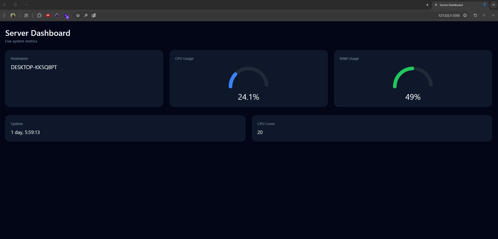
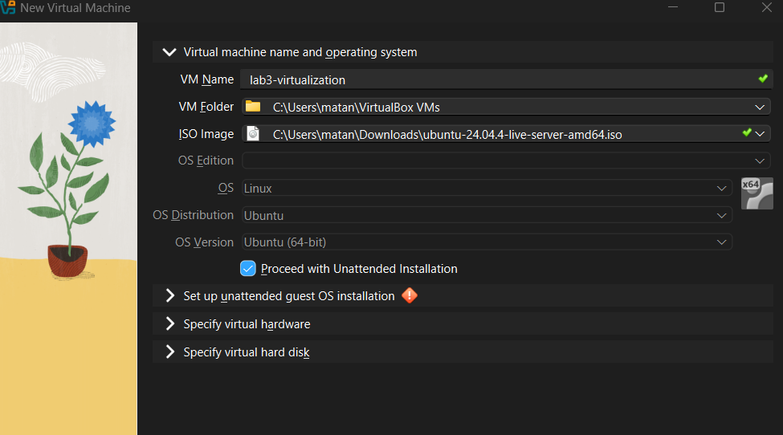
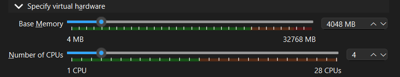
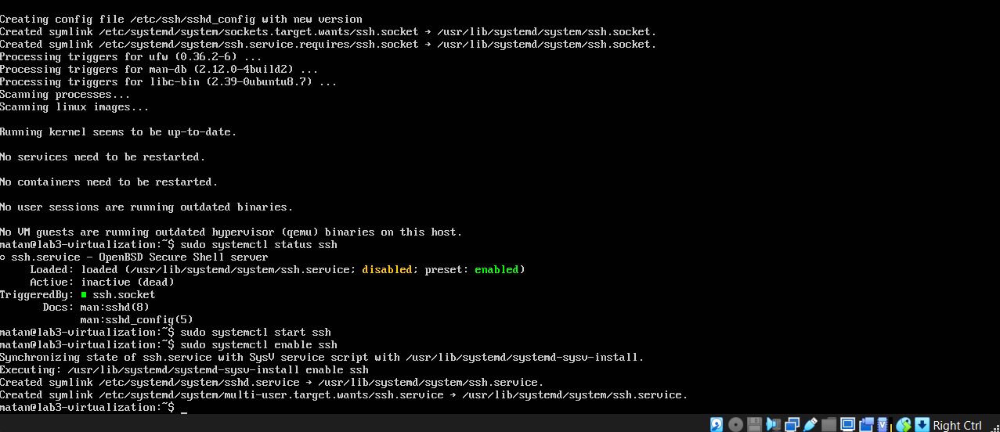
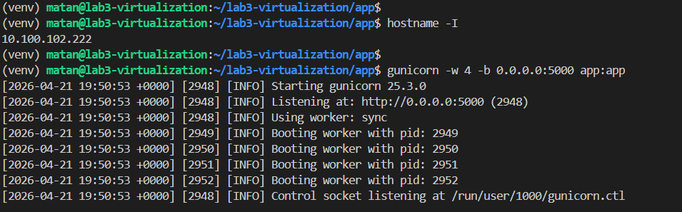
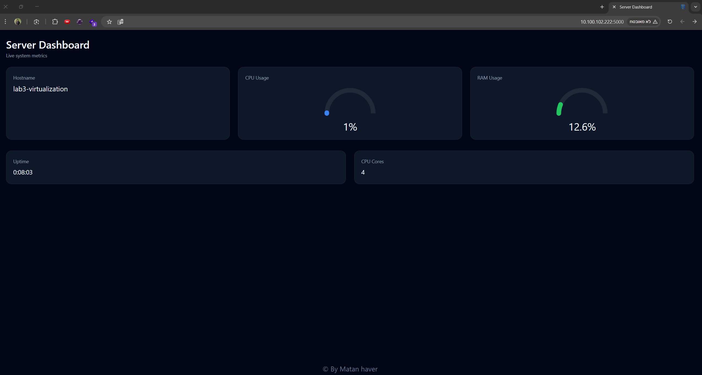
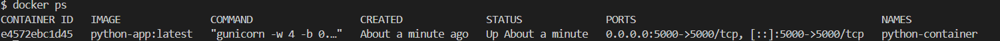
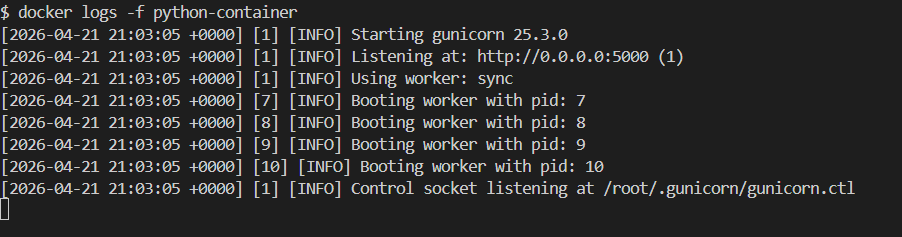
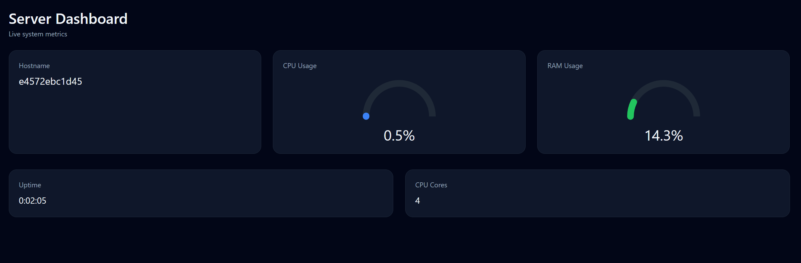

# lab3-virtualization

simple flask application that shows hostname and resources

## run on Host OS

`flask --app app/app.py run`  
Running on http://127.0.0.1:5000



## run on guest OS ubuntu




### after vm is up

```bash
sudo apt update -y
sudo apt install openssh-server -y
```



```bash
ssh matan@10.100.102.222
sudo apt install python3 python3-pip python3-venv -y


git clone https://github.com/matan77/lab3-virtualization.git
cd lab3-virtualization/app
python3 -m venv venv
source venv/bin/activate
pip install -r requirements.txt
gunicorn -w 4 -b 0.0.0.0:5000 app:app
```




## run on Docker container

```bash
cd app
docker build -t python-app:latest .
docker run -d --name python-container -p 5000:5000 python-app:latest
docker ps
docker logs -f python-container
```





