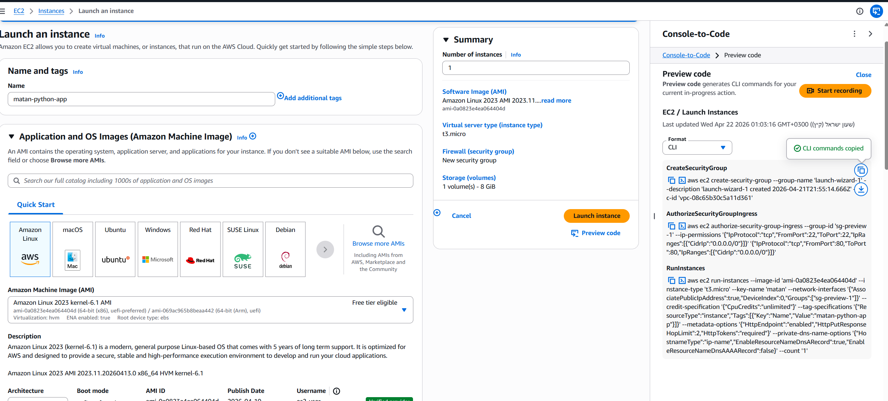
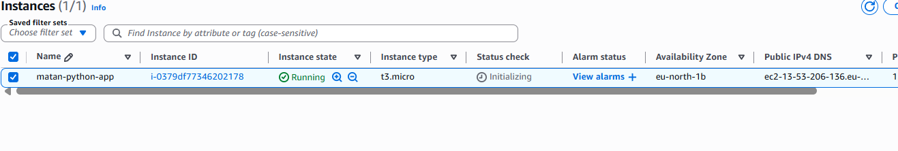
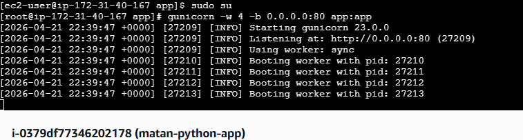
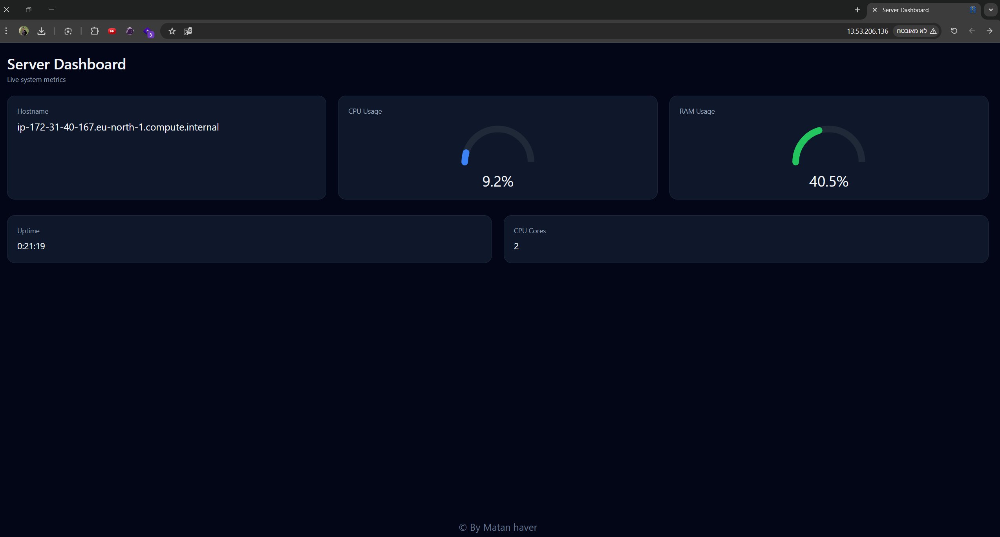

# lab3-virtualization

simple flask application that shows hostname and resources

## run on Host OS

`flask --app app/app.py run`  
Running on http://127.0.0.1:5000


## run on guest OS ubuntu


### after vm is up

```bash
sudo apt update -y
sudo apt install openssh-server -y
```


```bash
ssh matan@10.100.102.222
sudo apt install python3 python3-pip python3-venv -y


git clone https://github.com/matan77/lab3-virtualization.git
cd lab3-virtualization/app
python3 -m venv venv
source venv/bin/activate
pip install -r requirements.txt
gunicorn -w 4 -b 0.0.0.0:5000 app:app
```


## run on Docker container

```bash
cd app
docker build -t python-app:latest .
docker run -d --name python-container -p 5000:5000 python-app:latest
docker ps
docker logs -f python-container
```


## run on EC2 instance

created the instance from the Ui

> for the app to run as non root user I can use nginx as a reverse proxy but it require extra setup which is not part of the task

> I terminated the EC2 instance to avoid credit spending, so the website at http://13.53.206.136/ is not longer accessible





### commands to configure the app

```bash
sudo dnf install git -y
sudo dnf install python3 python3-pip -y
git clone https://github.com/matan77/lab3-virtualization.git
cd lab3-virtualization/app
sudo su
pip install -r requirements.txt
gunicorn -w 4 -b 0.0.0.0:5000 app:app
```




